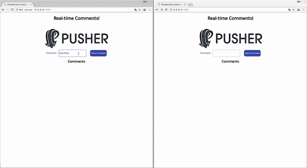

# Adding Realtime Functionality to Rails Application 

This is a demo application showing how to Add Realtime Functionality to your Rails application by using either Action Cable or Pusher. You can read about how it was created [ on Pushers's blog ](https://blog.pusher.com/author/chris-nwamba)



## Getting Started
Follow these instructions to get a copy of this project up and running on your local machine for development and testing purposes.

### Prerequisites
- Git
- Ruby
- Rails

### Install 
Clone the repository

```
$ git clone https://github.com/christiannwamba/pusher-action-cable.git
```

Install dependecies
```
$ cd pusher-action-cable
$ gem install
```

Run migrations
```
$ rails db:migrate
```

### Run the application
```
$ rails server
```

## [ Optional ] Using Pusher
- Edit the config file in `config/initializers/pusher.rb` and add your application keys.
- Uncomment the pusher configurations in the `app/views/layouts/application.html.erb` file.
- Uncomment the code in the `app/views/welcome/index.html.erb` file.
- Uncomment the code in the `app/controllers/comment_controller.rb` file. 

## Built With
- [Ruby on Rails](https://rubyonrails.org) - An MVC Framework used for building web applications

## Acknowledgments
- [Ruby on Rails](https://rubyonrails.org) - Explicit documentation of ActionCable and how it works
